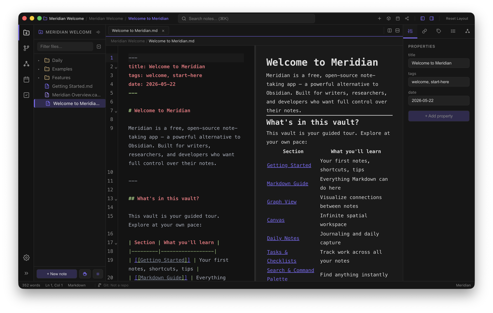
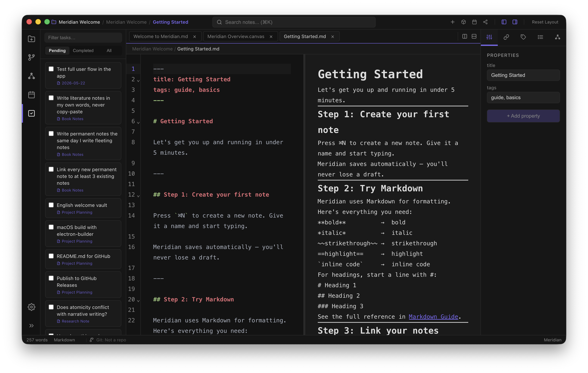
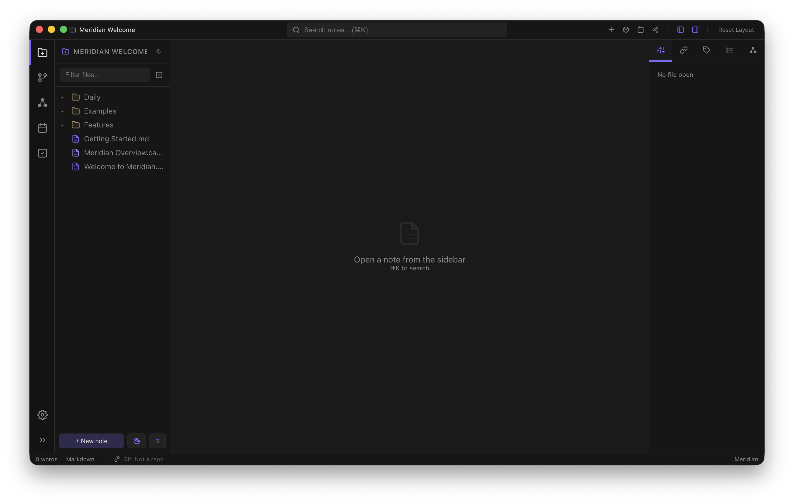
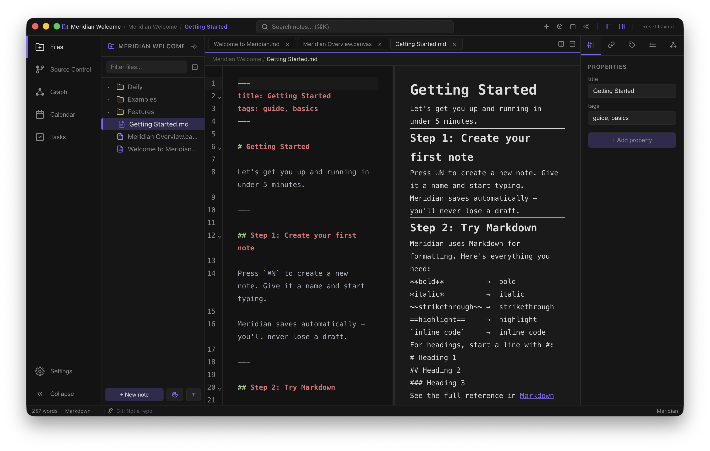
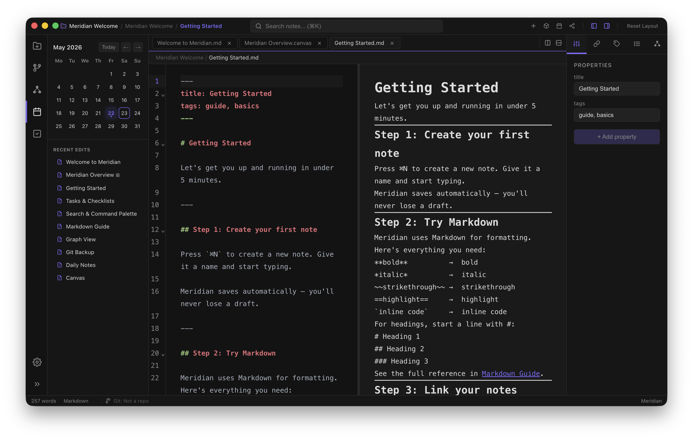
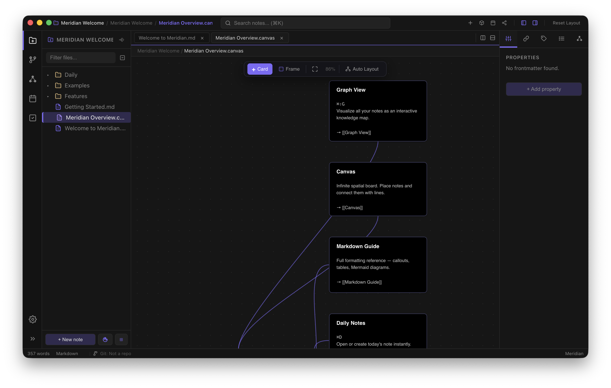
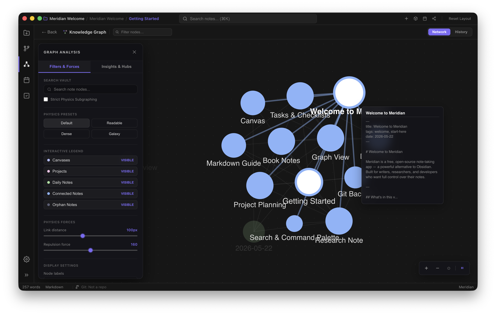
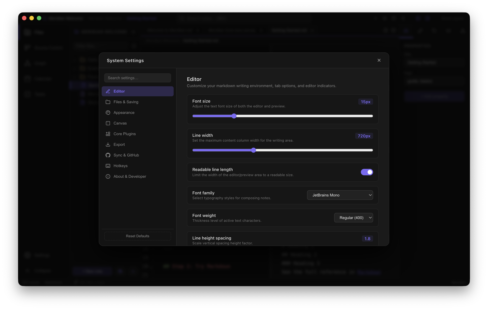
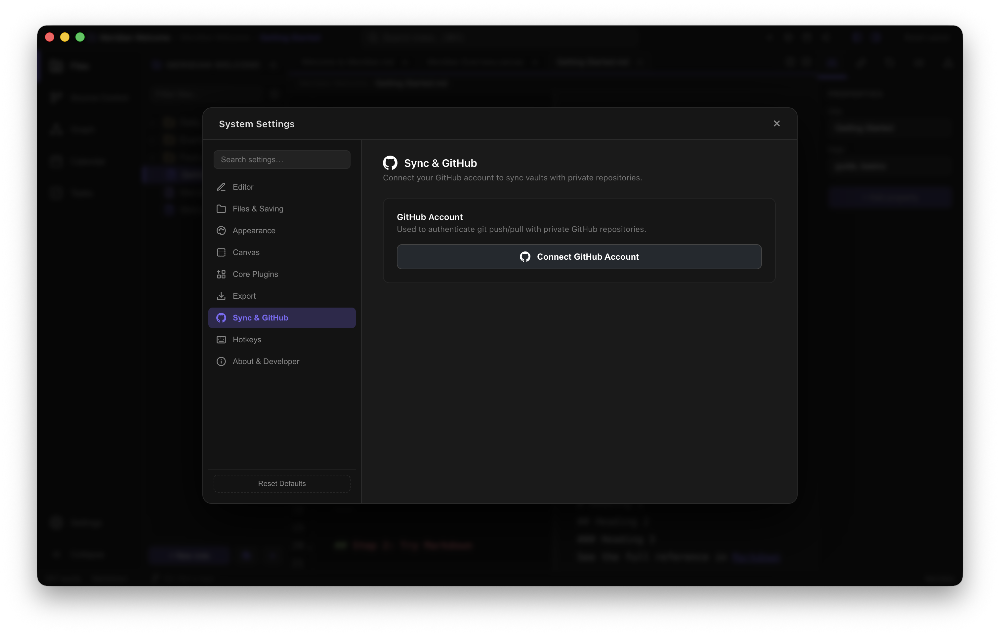
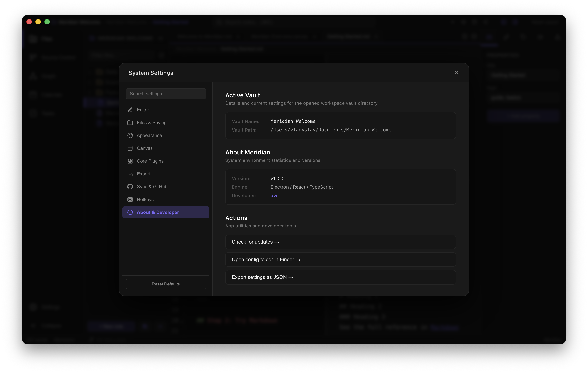

# Meridian

[](https://github.com/avedevelop/meridian/actions/workflows/meridian-ci.yml)
[](https://github.com/avedevelop/meridian/releases/latest)

Local-first notes app inspired by Obsidian — not a drop-in replacement. Built with Electron 39 + React 18 + TypeScript.



---

## Install

Meridian publishes one GitHub Release per version tag. The same tag contains the stable macOS builds and the Windows beta installer.

### macOS stable

1. Download the latest DMG from [Releases](https://github.com/avedevelop/meridian/releases/latest).
2. Open the DMG, drag Meridian into Applications.
3. **First launch:** the DMG is unsigned, so Gatekeeper will block a regular double-click. Right-click the app → **Open** → confirm once. Subsequent launches work normally.
4. Want a signed build? Watch the releases or build it yourself (`npm run build:mac` in `meridian/`).

### Windows beta

1. Download `Meridian-<version>-windows-beta-x64.exe` from the same [latest release](https://github.com/avedevelop/meridian/releases/latest).
2. Run the installer on Windows 10 or newer.
3. Treat this build as beta: the core app is shared with macOS, but Windows-specific packaging and desktop behavior are still being validated.

Platform notes live in [platforms/README.md](platforms/README.md).

---

## Run from source

```bash
cd meridian
npm install
npm run dev
```

> **Dev won't start?**
>
> If you see `TypeError: Cannot read properties of undefined (reading 'registerSchemesAsPrivileged')` —
> your environment (Cursor, VS Code) is exporting `ELECTRON_RUN_AS_NODE=1`, which forces Electron to start as plain Node.
>
> `npm run dev` already strips it via `env -u ELECTRON_RUN_AS_NODE`, but if the error still appears:
>
> ```bash
> unset ELECTRON_RUN_AS_NODE && npm run dev
> ```
>
> If port 5173 is held by a previous run:
>
> ```bash
> npm run dev:kill   # kill the process on :5173
> npm run dev
> ```

---

## Features

### Editor

- Markdown with syntax highlighting (CodeMirror 6)
- Wiki-links `[[Note Name]]` with autocompletion
- Multi-pane editor (horizontal and vertical split)
- Drag-and-drop tabs between panes
- Auto-save (debounced / on blur / on Alt+Tab)
- **Slash commands** — type `/` at the start of a line for a menu of headings, lists, tables, callouts



### Markdown preview

- Live render alongside the editor
- **Image wiki-embeds** — `![[photo.png]]` renders as an ``
- **Note embeds** — `![[Other Note]]` inlines another note's content
- **Callout blocks** in Obsidian style:
  > [!NOTE] Info
  > Supported: note, tip, warning, danger, success, question, and more
- **==Highlighted text==** — double equals for a yellow background
- **Mermaid diagrams** — ` ```mermaid` blocks render as SVG
- Tables (GitHub Flavored Markdown)
- Images via the `vault://` protocol (local files)

### File tree

- Create / rename / delete files and folders
- **Drag-drop both files AND folders** between directories
- **Sorting:** A→Z, Z→A, by modification date (sidebar button)
- Context menu: Reveal in Finder, Copy Path, Copy Relative Path





### Search and navigation

- Full-text search across the vault (MiniSearch)
- **Command Palette** (⌘K) — file search and commands (`>` for command mode)
- **Recent files** — top section in the palette shows the 5 last opened
- Backlinks, tags, Table of Contents in the right panel
- Local link graph for the current note



### Tags

- Inline `#tag` in body text
- **Tags from frontmatter** — `tags: [work, ideas]` or YAML lists show up in the Tags panel

### Properties (frontmatter)

- **Props** tab in the right panel
- Shows and edits YAML frontmatter as form fields
- "+ Add property" button

### Templates

- Drop `.md` files into `_templates/` inside your vault
- Open the palette (⌘K → `>`) → "Insert Template…" → pick one
- Placeholders: `{{date}}`, `{{title}}`

### Export

- **HTML** (⌘E) — export a note as a self-contained HTML file with styles
- **PDF** (⌘⇧E) — export through Electron `printToPDF`, with a save dialog

### Canvas and Sketchpad

- Infinite Canvas with cards (Konva) — `.canvas` files
- Sketchpad — pencil, shapes, text — `.excalidraw` files
- Eraser supports partial erasing across all shape types
- Undo (⌘Z) in both modes



### Graph view

- D3 force-directed graph of the whole vault
- Timeline animation
- Export as WebM video



### Settings (⌘,)

- 8 themes: dark, midnight, indigo, cyberpunk, forest, nord, dracula, obsidian
- 5 accent colors
- Editor fonts: Georgia, Inter, Fira Code, JetBrains Mono, system-ui
- Font size, line height, line width
- Toggles: line wrap, line numbers, bracket matching, slash commands
- Auto-save modes, Git backup







### Git Backup (plugin)

- Auto-commit every 5 minutes and on window minimize
- Works when the vault is a git repository

---

## Keyboard shortcuts

| Shortcut | Action                            |
| -------- | --------------------------------- |
| ⌘K       | Command Palette                   |
| ⌘S       | Save                              |
| ⌘E       | Export to HTML                    |
| ⌘⇧E      | Export to PDF                     |
| ⌘D       | Daily Note                        |
| ⌘W       | Close tab                         |
| ⌘Z       | Undo (in Canvas / Sketchpad)      |
| ⌘,       | Settings                          |
| ⌘⇧G      | Graph View                        |
| /        | Slash commands (start of line)    |
| >        | Command mode in Command Palette   |

---

## Vault structure

```
your-vault/
├── _templates/        ← templates for insertion
│   └── daily.md
├── assets/            ← images (paste-friendly)
├── Daily/             ← Daily Notes (⌘D)
└── your notes…
```

---

## Build

The app has one shared Electron/React codebase and platform-specific packaging. macOS is stable; Windows is published as beta from the same release tag. Linux packaging exists in electron-builder config but is not part of public releases yet.

```bash
cd meridian
npm run build:mac    # macOS DMG (arm64 + x64)
npm run build:win    # Windows beta installer (x64)
```

Release workflow:

- Push `vX.Y.Z` to build one GitHub Release for both platforms.
- macOS assets: `Meridian-X.Y.Z-arm64.dmg`, `Meridian-X.Y.Z.dmg`.
- Windows beta asset: `Meridian-X.Y.Z-windows-beta-x64.exe`.
- The site rebuild runs after both platform jobs finish, so download cards resolve all assets together.

## Tests

```bash
cd meridian
npm run test         # Vitest
npm run typecheck    # TypeScript (node + web projects)
npm run lint         # ESLint
npm run check-lines  # per-component line limits (see ARCHITECTURE.md)
```

Run all four before committing or opening a PR: `lint && typecheck && test && check-lines`.

---

## Documentation

- [ARCHITECTURE.md](ARCHITECTURE.md) — modularity rules and component file-size limits
- [SCOPE.md](SCOPE.md) — what Meridian is and isn't
- [platforms/README.md](platforms/README.md) — platform support, packaging, and release assets
- [PLUGIN_DEVELOPMENT.md](PLUGIN_DEVELOPMENT.md) — community plugin authoring guide
- [CHANGELOG.md](CHANGELOG.md) — release notes

---

## Contributing

Contributions are welcome. Please open an issue first to discuss what you'd like to change. See [CONTRIBUTING.md](CONTRIBUTING.md) and [CODE_OF_CONDUCT.md](CODE_OF_CONDUCT.md).

---

## License

Apache 2.0 — see [LICENSE](LICENSE) for details.
