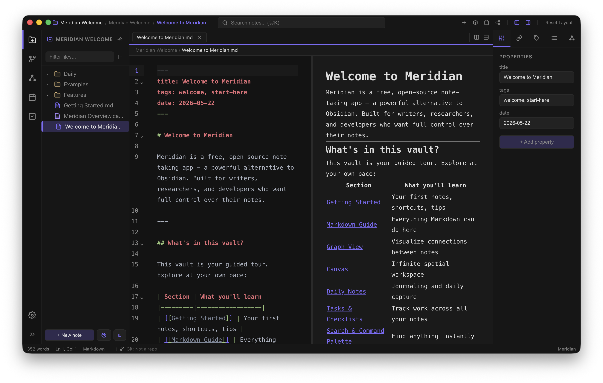
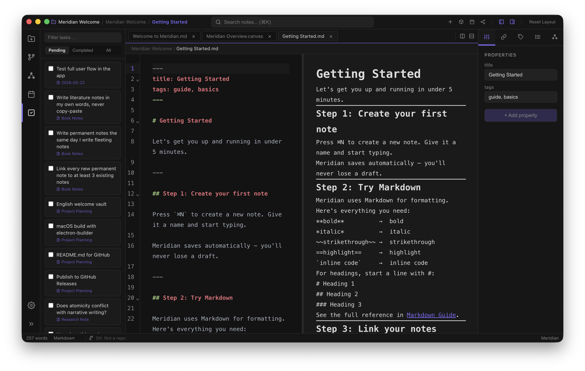
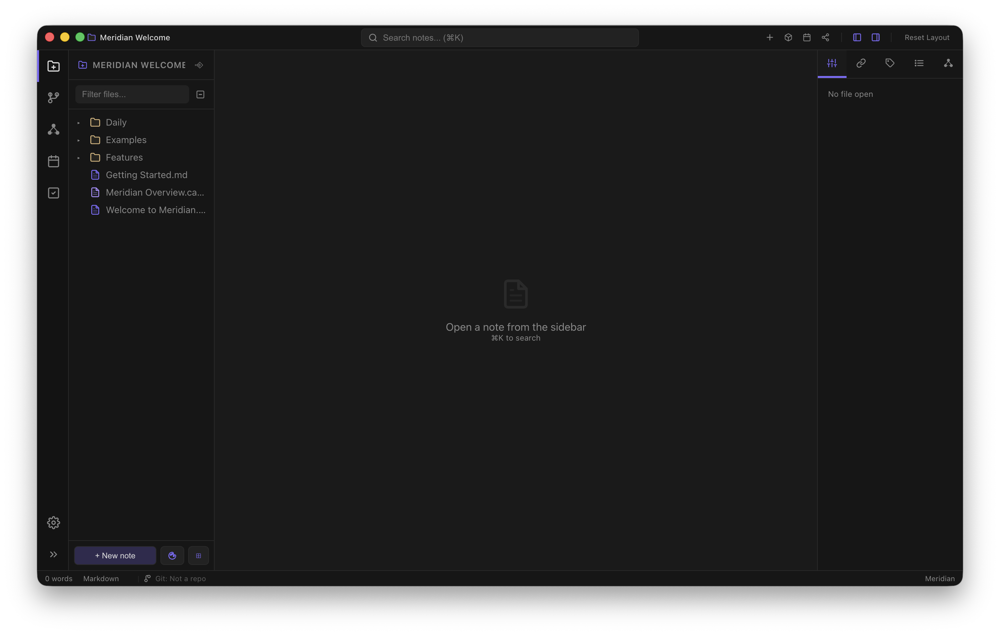
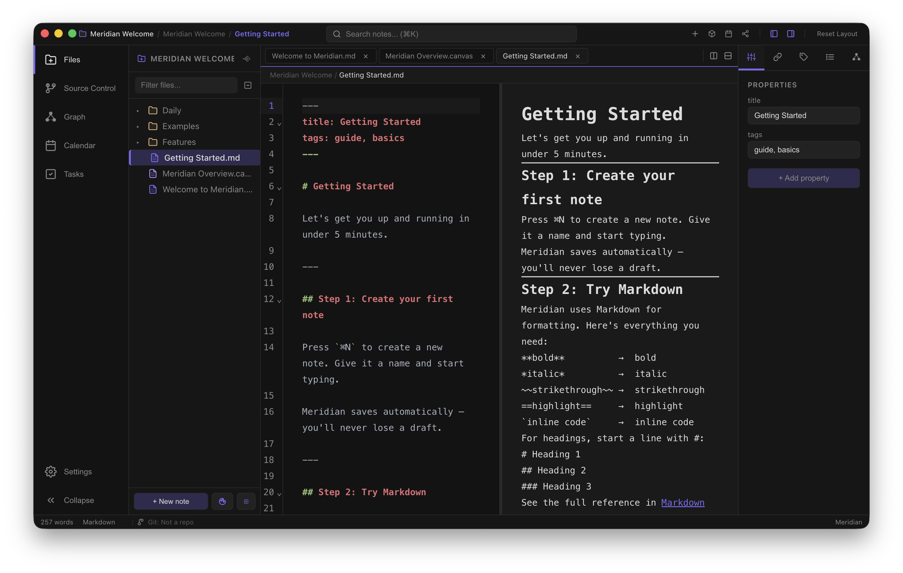
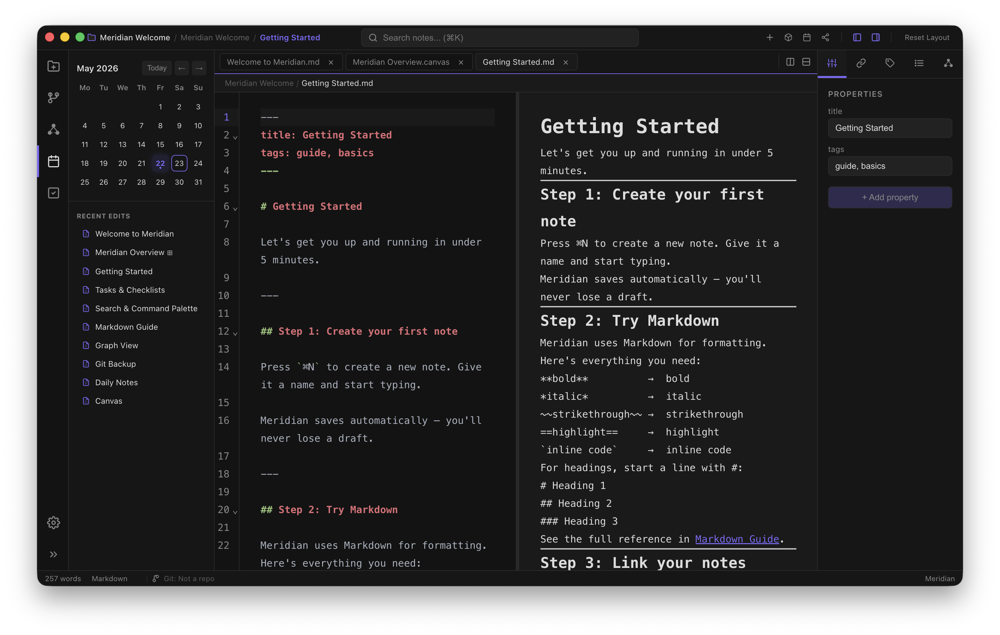
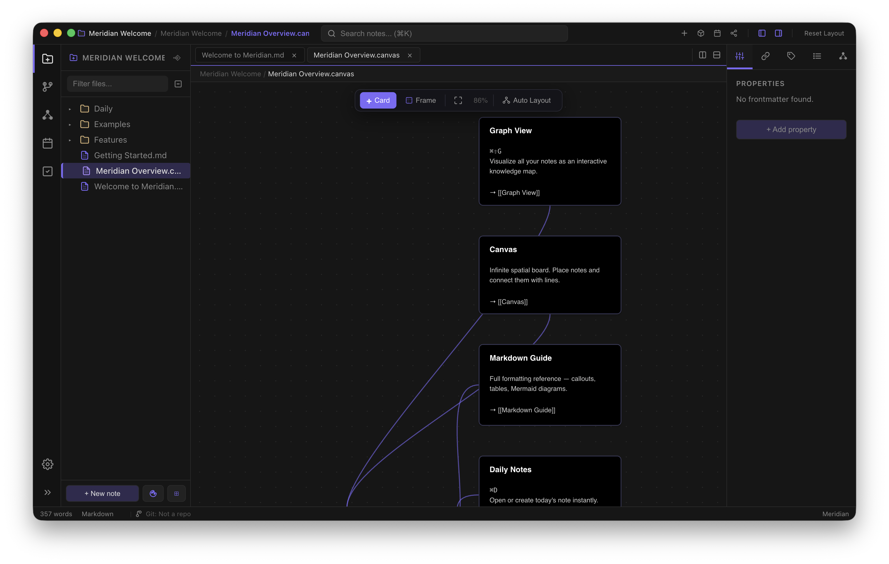
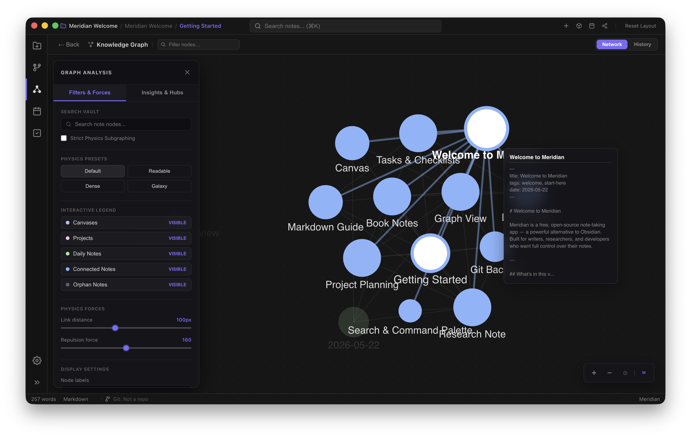
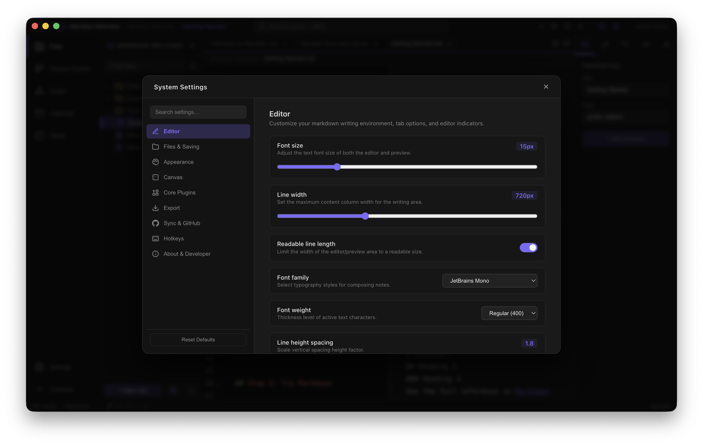
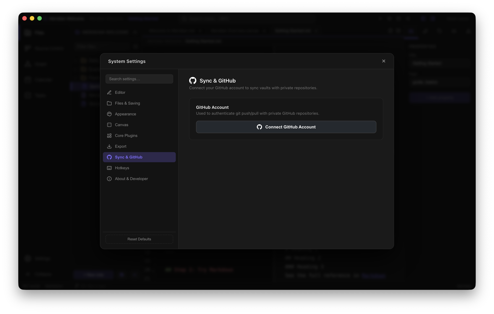
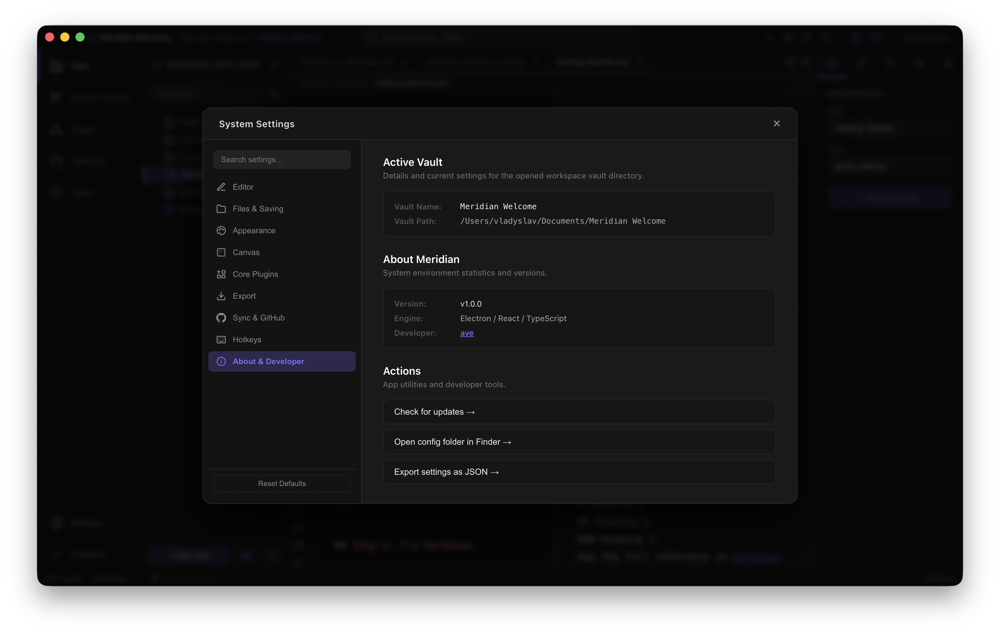

# Meridian

[](https://github.com/avedevelop/meridian/actions/workflows/meridian-ci.yml)
[](https://github.com/avedevelop/meridian/releases/latest)

Local-first notes app inspired by Obsidian — not a drop-in replacement. Built with Electron 39 + React 19 + TypeScript.



---

## Install

Meridian publishes one GitHub Release per version tag. The same tag contains macOS and Windows desktop builds.

### macOS

1. Download the latest DMG from [Releases](https://github.com/avedevelop/meridian/releases/latest).
2. Open the DMG, drag Meridian into Applications.
3. **First launch:** the DMG is unsigned, so Gatekeeper will block a regular double-click. Right-click the app → **Open** → confirm once. Subsequent launches work normally.
4. Want a signed build? Watch the releases or build it yourself (`npm run build:mac` in `meridian/`).

### Windows

1. Download `Meridian-<version>-windows-x64.exe` from the same [latest release](https://github.com/avedevelop/meridian/releases/latest).
2. Run the installer on Windows 10 or newer.
3. Open Meridian from the Start Menu or desktop shortcut.

Platform notes live in [platforms/README.md](platforms/README.md).

---

## Run from source

```bash
cd meridian
npm install
npm run dev
```

> **Dev won't start?**
>
> If you see `TypeError: Cannot read properties of undefined (reading 'registerSchemesAsPrivileged')` —
> your environment (Cursor, VS Code) is exporting `ELECTRON_RUN_AS_NODE=1`, which forces Electron to start as plain Node.
>
> `npm run dev` already strips it via `env -u ELECTRON_RUN_AS_NODE`, but if the error still appears:
>
> ```bash
> unset ELECTRON_RUN_AS_NODE && npm run dev
> ```
>
> If port 5173 is held by a previous run:
>
> ```bash
> npm run dev:kill   # kill the process on :5173
> npm run dev
> ```

---

## Features

### Editor

- Markdown with syntax highlighting (CodeMirror 6)
- Wiki-links `[[Note Name]]` with autocompletion
- Multi-pane editor (horizontal and vertical split)
- Drag-and-drop tabs between panes
- Auto-save (debounced / on blur / on Alt+Tab)
- **Slash commands** — type `/` at the start of a line for a menu of headings, lists, tables, callouts



### Markdown preview

- Live render alongside the editor
- **Image wiki-embeds** — `![[photo.png]]` renders as an ``
- **Note embeds** — `![[Other Note]]` inlines another note's content
- **Callout blocks** in Obsidian style:
  > [!NOTE] Info
  > Supported: note, tip, warning, danger, success, question, and more
- **==Highlighted text==** — double equals for a yellow background
- **Mermaid diagrams** — ` ```mermaid` blocks render as SVG
- Tables (GitHub Flavored Markdown)
- Images via the `vault://` protocol (local files)

### File tree

- Create / rename / delete files and folders
- Create new notes from built-in templates: project, person, daily note, and task
- **Drag-drop both files AND folders** between directories
- **Sorting:** A→Z, Z→A, by modification date (sidebar button)
- Context menu: Reveal in Finder, Copy Path, Copy Relative Path





### Search and navigation

- Full-text search across the vault (MiniSearch)
- **Command Palette** (⌘K) — file search and commands (`>` for command mode)
- **Recent files** — top section in the palette shows the 5 last opened
- Backlinks, tags, Table of Contents in the right panel
- Local link graph for the current note



### Tags

- Inline `#tag` in body text
- **Tags from frontmatter** — `tags: [work, ideas]` or YAML lists show up in the Tags panel

### Properties (frontmatter)

- **Props** tab in the right panel
- Shows and edits YAML frontmatter as form fields
- "+ Add property" button

### Note types, relationships, and views

- Built-in note types for projects, people, daily notes, and tasks
- Relationship properties in frontmatter resolve between notes and show in the right panel
- Saved Views in the sidebar for Inbox, Projects, Tasks, and Daily workflows
- Per-note Git history in the right panel with preview and restore controls
- Read-only Ask Vault panel that searches local note context and cites source notes

### Templates

- Drop `.md` files into `_templates/` inside your vault
- Open the palette (⌘K → `>`) → "Insert Template…" → pick one
- Placeholders: `{{date}}`, `{{title}}`

### Export

- **HTML** (⌘E) — export a note as a self-contained HTML file with styles
- **PDF** (⌘⇧E) — export through Electron `printToPDF`, with a save dialog

### Canvas and Sketchpad

- Infinite Canvas with cards (Konva) — `.canvas` files
- Sketchpad — pencil, shapes, text — `.excalidraw` files
- Eraser supports partial erasing across all shape types
- Undo (⌘Z) in both modes



### Graph view

- D3 force-directed graph of the whole vault
- Timeline animation
- Export as WebM video



### Settings (⌘,)

- 8 themes: dark, midnight, indigo, cyberpunk, forest, nord, dracula, obsidian
- 5 accent colors
- Editor fonts: Georgia, Inter, Fira Code, JetBrains Mono, system-ui
- Font size, line height, line width
- Toggles: line wrap, line numbers, bracket matching, slash commands
- Auto-save modes, Git backup







### Git Backup (plugin)

- Auto-commit every 5 minutes and on window minimize
- Works when the vault is a git repository

### Quick Capture

- Press `⌘⇧N` (`Ctrl+Shift+N` on Windows) from any app to jot a line into `Inbox.md`

### Clipboard history

Off until you turn it on (Settings → System → Clipboard history, or the prompt in the history window).
Everything stays on your computer.

- Open it from any app with `⌘⇧H` (`Ctrl+Shift+H` on Windows); the shortcut can be changed in Settings
- Search, filter (text, links, images, pinned, snippets), pin entries, delete entries
- `Enter` copies an entry back, `Shift+Enter` copies it as plain text
- **Save to a note**: `⌘Enter` appends to `Inbox.md`, `⌘D` to today's daily note, `⌘⇧Enter` creates a new note.
  Links become `<url>`, tab-separated cells become a Markdown table, code becomes a fenced block, images are
  saved to your attachment folder
- **Snippets**: notes in `_snippets/` appear in the same window; `{{date}}`, `{{time}}` and `{{clipboard}}` are
  filled in when you copy one
- Keeps up to 5,000 entries for 30 days by default (both adjustable); pinned entries are kept until you remove them

**Privacy.** Copies that password managers mark as private (the standard Windows and macOS clipboard flags) are
skipped. Text that looks like a secret (private keys, API tokens, card numbers) is hidden in the list and left
out of search, or not recorded at all if you choose. "Clear history" deletes every entry and all saved images.

Limits: the history is stored unencrypted in the app's data folder; the private-copy flags only work when the
other app sets them; secret detection is a heuristic, not a guarantee; Meridian does not know which app a copy
came from, so it cannot ignore specific apps; it cannot paste into the previous window for you yet.

### Running in the background

Settings → System: keep Meridian in the system tray when you close the window (so the clipboard history and
Quick Capture shortcuts keep working), start it when you sign in, and start minimized to the tray.

---

## Keyboard shortcuts

| Shortcut | Action                            |
| -------- | --------------------------------- |
| ⌘K       | Command Palette                   |
| ⌘S       | Save                              |
| ⌘E       | Export to HTML                    |
| ⌘⇧E      | Export to PDF                     |
| ⌘D       | Daily Note                        |
| ⌘W       | Close tab                         |
| ⌘Z       | Undo (in Canvas / Sketchpad)      |
| ⌘,       | Settings                          |
| ⌘⇧G      | Graph View                        |
| ⌘⇧N      | Quick Capture (global)            |
| ⌘⇧H      | Clipboard history (global)        |
| /        | Slash commands (start of line)    |
| >        | Command mode in Command Palette   |

---

## Vault structure

```
your-vault/
├── _templates/        ← templates for insertion
│   └── daily.md
├── _snippets/         ← text snippets for the clipboard window
├── Inbox.md           ← Quick Capture and clipboard "save to Inbox"
├── assets/            ← images (paste-friendly)
├── Daily/             ← Daily Notes (⌘D)
└── your notes…
```

---

## Performance

Numbers from our own benchmarks (synthetic vaults, a Linux container; they do not include Electron's file
reads, so treat them as relative):

- Opening a vault of 10,000 notes builds the link and search index in about 1.2 s; saving one note then costs
  about 36 ms. See [meridian/bench/vault](meridian/bench/vault/README.md).
- The first screen renders in about 0.5 s instead of 0.9 s on a throttled CPU after lazy-loading heavy screens.
  See [meridian/bench/startup](meridian/bench/startup/README.md).

You can generate a large vault to try yourself: `node bench/vault/run.mjs --write ./big-vault` in `meridian/`.

## Plugins

Community plugins are not sandboxed: they run with the same access as the app. Only enable plugins you trust.
See [docs/plugin-security-audit.md](docs/plugin-security-audit.md).

---

## Build

The app has one shared Electron/React codebase and platform-specific packaging. macOS and Windows are both published from the same release tag. Linux packaging exists in electron-builder config but is not part of public releases yet.

```bash
cd meridian
npm run build:mac    # macOS DMG (arm64 + x64)
npm run build:win    # Windows installer (x64)
```

Release workflow:

- Push `vX.Y.Z` to build one GitHub Release for both platforms.
- macOS assets: `Meridian-X.Y.Z-arm64.dmg`, `Meridian-X.Y.Z.dmg`.
- Windows asset: `Meridian-X.Y.Z-windows-x64.exe`.
- The site rebuild runs after both platform jobs finish, so download cards resolve all assets together.

## Tests

```bash
cd meridian
npm run test         # Vitest
npm run typecheck    # TypeScript (node + web projects)
npm run lint         # ESLint
npm run check-lines  # per-component line limits (see ARCHITECTURE.md)
```

Run all four before committing or opening a PR: `lint && typecheck && test && check-lines`.

---

## Documentation

- [ARCHITECTURE.md](ARCHITECTURE.md) — modularity rules and component file-size limits
- [SCOPE.md](SCOPE.md) — what Meridian is and isn't
- [platforms/README.md](platforms/README.md) — platform support, packaging, and release assets
- [PLUGIN_DEVELOPMENT.md](PLUGIN_DEVELOPMENT.md) — community plugin authoring guide
- [docs/clipboard-design.md](docs/clipboard-design.md) — how the clipboard history works and its limits
- [docs/plugin-security-audit.md](docs/plugin-security-audit.md) — what a plugin can access
- [CHANGELOG.md](CHANGELOG.md) — release notes

---

## Contributing

Contributions are welcome. Please open an issue first to discuss what you'd like to change. See [CONTRIBUTING.md](CONTRIBUTING.md) and [CODE_OF_CONDUCT.md](CODE_OF_CONDUCT.md).

---

## License

Apache 2.0 — see [LICENSE](LICENSE) for details.
